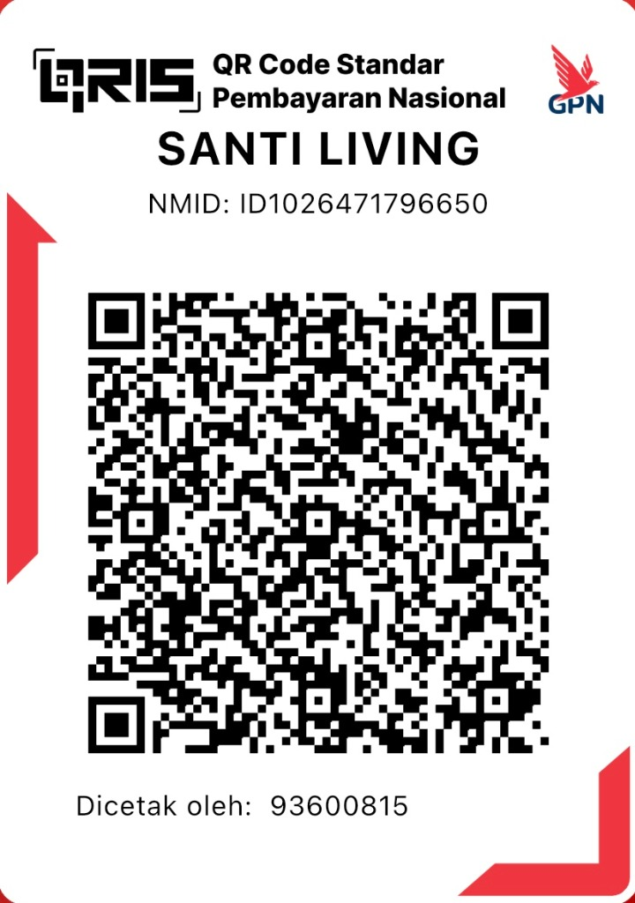

# Feature Specification: Checkout & Payment Flow

**Feature Branch**: `003-checkout-payment-flow`  
**Created**: 2026-01-10  
**Status**: Draft  
**Input**: User description: "Di kalkulator hapus metode pembayaran, itu masuk ke halaman khusus aja. Jadi tombol jangan diubah, cuma nanti waktu klik tombol WhatsApp, dia masuk ke halaman /checkout, muncul summary, dan ada pilih metode transfer. Pilihannya tf BCA Muthia Rahma Syamila 0374668427 atau QRIS statis. Kalau tf BCA, norek dan nominal bisa di copy, kalau QRIS, tampilkan QR-nya dan ada tombol download. CTA konfirmasi metode pembayaran -> masuk ke halaman pembayaran, CTA konfirmasi pembayaran -> masuk ke halaman /thank-you dan open tab wa.me untuk kirim bukti pembayaran. Bot WA existing flow tidak diubah - jadi saat ke halaman checkout, WA juga terkirim."

## Existing Flow (PRESERVED)

> [!IMPORTANT]
> Flow WA Bot yang sudah ada **TIDAK DIUBAH**. Saat pelanggan submit order, sistem tetap memanggil `sendOrderToBot()` API untuk mengirim notifikasi otomatis ke WA pelanggan. Fitur baru adalah penambahan halaman checkout untuk pembayaran.

**Current Flow (to preserve):**

1. Pelanggan isi kalkulator (pilih produk, durasi, alamat, dll)
2. Klik tombol "Pesan via WhatsApp"
3. Sistem validasi form
4. Sistem panggil `sendOrderToBot()` API → WA Bot kirim pesan ke pelanggan
5. Tampil success message

**New Flow (after this feature):**

1. Pelanggan isi kalkulator (pilih produk, durasi, alamat, dll) ─ metode pembayaran DIHAPUS dari sini
2. Klik tombol "Pesan via WhatsApp"
3. Sistem validasi form
4. Sistem panggil `sendOrderToBot()` API → WA Bot kirim pesan ke pelanggan (**TETAP**)
5. **REDIRECT** ke halaman `/checkout` dengan order summary
6. Pelanggan pilih metode pembayaran (BCA Transfer / QRIS)
7. Klik "Konfirmasi Metode Pembayaran" → UI berubah ke step instruksi bayar (di halaman yang sama)
8. Klik "Konfirmasi Pembayaran" → ke halaman `/thank-you` + open wa.me untuk kirim bukti bayar

## Clarifications

### Session 2026-01-10

- Q: Apakah halaman checkout dan payment terpisah atau satu halaman? → A: Single page multi-step (checkout = summary + payment dalam 1 halaman `/checkout`, UI berubah setelah pilih metode)

## User Scenarios & Testing _(mandatory)_

### User Story 1 - Complete Checkout with BCA Transfer (Priority: P1)

Sebagai pelanggan yang sudah memilih produk sewa kasur, saya ingin melakukan checkout dan membayar via transfer BCA agar pesanan saya dapat diproses.

**Why this priority**: Ini adalah flow utama untuk conversion - tanpa ini tidak ada transaksi yang bisa diselesaikan.

**Independent Test**: Flow ini dapat diuji end-to-end dari halaman kalkulator → checkout → payment → thank-you page.

**Acceptance Scenarios**:

1. **Given** pelanggan sudah submit order dari kalkulator (WA bot sudah terkirim), **When** sistem selesai proses order, **Then** pelanggan di-redirect ke halaman `/checkout` dengan summary pesanan yang menampilkan: nama pelanggan, alamat pengiriman, daftar produk (nama, jumlah, harga per hari), durasi sewa, tanggal mulai-selesai, subtotal, ongkir, dan total harga.

2. **Given** pelanggan di halaman checkout melihat summary order, **When** pelanggan memilih metode pembayaran BCA, **Then** sistem menampilkan no. rekening `0374668427` a/n `Muthia Rahma Syamila` beserta nominal yang harus dibayar (sesuai total di summary), dengan tombol copy untuk masing-masing.

3. **Given** pelanggan memilih BCA dan melihat info transfer, **When** pelanggan klik "Konfirmasi Metode Pembayaran", **Then** pelanggan diarahkan ke halaman pembayaran dengan instruksi transfer.

4. **Given** pelanggan di halaman pembayaran, **When** pelanggan klik "Konfirmasi Pembayaran", **Then** pelanggan diarahkan ke halaman `/thank-you` DAN otomatis membuka tab wa.me dengan pesan pre-filled untuk kirim bukti pembayaran.

---

### User Story 2 - Complete Checkout with QRIS (Priority: P1)

Sebagai pelanggan yang sudah memilih produk sewa kasur, saya ingin melakukan checkout dan membayar via QRIS agar pesanan saya dapat diproses dengan cepat.

**Why this priority**: QRIS adalah alternatif pembayaran utama yang semakin populer, sama pentingnya dengan BCA transfer.

**Independent Test**: Flow ini dapat diuji end-to-end dari halaman kalkulator → checkout → payment → thank-you page.

**Acceptance Scenarios**:

1. **Given** pelanggan di halaman checkout melihat summary order (nama pelanggan, alamat, daftar produk, durasi, tanggal, subtotal, ongkir, total), **When** pelanggan memilih metode pembayaran QRIS, **Then** sistem menampilkan gambar QRIS statis untuk SANTI LIVING (NMID: ID1026471796650) beserta nominal yang harus dibayar dengan tombol copy.

2. **Given** pelanggan melihat QRIS, **When** pelanggan klik tombol "Download QRIS", **Then** gambar QRIS terdownload ke device pelanggan.

3. **Given** pelanggan sudah scan/download QRIS, **When** pelanggan klik "Konfirmasi Metode Pembayaran", **Then** pelanggan diarahkan ke halaman pembayaran.

4. **Given** pelanggan di halaman pembayaran, **When** pelanggan klik "Konfirmasi Pembayaran", **Then** pelanggan diarahkan ke halaman `/thank-you` DAN otomatis membuka tab wa.me dengan pesan pre-filled untuk kirim bukti pembayaran.

---

### User Story 3 - View Order Summary at Checkout (Priority: P2)

Sebagai pelanggan, saya ingin melihat ringkasan pesanan saya sebelum memilih metode pembayaran agar saya yakin pesanan saya sudah benar.

**Why this priority**: Summary adalah informasi penting tapi bersifat read-only, tidak blocking untuk flow utama.

**Independent Test**: Dapat diuji dengan memverifikasi data yang ditampilkan sesuai dengan pilihan di kalkulator.

**Acceptance Scenarios**:

1. **Given** pelanggan sudah submit order dari kalkulator, **When** pelanggan masuk ke halaman checkout, **Then** sistem menampilkan ringkasan: nama produk, jumlah unit, durasi sewa, tanggal mulai, total harga, nama pelanggan, dan alamat.

2. **Given** pelanggan melihat summary, **When** data tidak sesuai dan klik tombol "Edit Pesanan", **Then** pelanggan diarahkan ke halaman `/cart` dengan semua field prefilled persis seperti yang diisi user saat di kalkulator (produk, quantity, durasi, tanggal, nama, alamat, dll).

---

### User Story 4 - Remove Payment Method from Calculator (Priority: P2)

Sebagai pemilik bisnis, saya ingin memindahkan pilihan metode pembayaran dari kalkulator ke halaman terpisah agar flow checkout lebih terstruktur dan pelanggan fokus pada pemilihan produk terlebih dahulu.

**Why this priority**: Ini adalah perubahan UI yang mendukung flow baru, bukan fungsi baru.

**Independent Test**: Dapat diuji dengan memverifikasi kalkulator tidak lagi menampilkan opsi pembayaran.

**Acceptance Scenarios**:

1. **Given** pelanggan di halaman dengan kalkulator, **When** pelanggan berinteraksi dengan kalkulator, **Then** tidak ada opsi pemilihan metode pembayaran yang ditampilkan.

2. **Given** pelanggan sudah isi semua form kalkulator, **When** pelanggan klik tombol WhatsApp, **Then** WA bot tetap terkirim DAN pelanggan redirect ke `/checkout`.

---

### User Story 5 - Preserve WhatsApp Bot Flow (Priority: P1)

Sebagai pemilik bisnis, saya ingin memastikan WA bot tetap berjalan seperti sebelumnya saat pelanggan submit order, sehingga notifikasi otomatis tetap terkirim.

**Why this priority**: Ini adalah flow existing yang kritis - jangan sampai rusak.

**Independent Test**: Dapat diuji dengan submit order dan verifikasi WA bot terkirim ke pelanggan.

**Acceptance Scenarios**:

1. **Given** pelanggan sudah isi form kalkulator dengan valid, **When** pelanggan klik tombol "Pesan via WhatsApp", **Then** sistem memanggil `sendOrderToBot()` API seperti sebelumnya.

2. **Given** API call berhasil, **When** WA bot berhasil terkirim, **Then** pelanggan di-redirect ke halaman `/checkout` (bukan tampil success message di tempat).

3. **Given** API call gagal, **When** terjadi error, **Then** tampil error message seperti sebelumnya (tidak redirect).

---

### Edge Cases

- Apa yang terjadi jika pelanggan mengakses `/checkout` langsung tanpa data pesanan dari kalkulator? → Redirect ke halaman utama dengan pesan
- Bagaimana sistem handle jika pelanggan gagal copy nomor rekening/nominal? → Tetap tampilkan info, user bisa manual copy
- Apa yang terjadi jika download QRIS gagal pada device tertentu? → Fallback: tampilkan instruksi untuk screenshot
- Bagaimana jika pelanggan menutup tab WhatsApp sebelum mengirim bukti bayar? → Di thank-you page ada link untuk reopen WA
- Apa yang terjadi jika API `sendOrderToBot()` timeout? → Tampil error, tidak redirect ke checkout

## Requirements _(mandatory)_

### Functional Requirements

- **FR-001**: Sistem HARUS menghilangkan opsi metode pembayaran dari komponen kalkulator
- **FR-002**: Sistem HARUS tetap memanggil `sendOrderToBot()` API saat pelanggan submit order
- **FR-003**: Sistem HARUS redirect ke halaman `/checkout` setelah WA bot berhasil terkirim (bukan tampil success message di tempat)
- **FR-004**: Sistem HARUS menyediakan halaman `/checkout` dengan UI multi-step:
  - Step 1: Summary pesanan + pilih metode pembayaran
  - Step 2: Instruksi pembayaran + tombol konfirmasi
- **FR-005**: Sistem HARUS menyediakan 2 metode pembayaran: Transfer BCA dan QRIS
- **FR-006**: Untuk metode BCA, sistem HARUS menampilkan:
  - Nama bank: BCA
  - Nama rekening: Muthia Rahma Syamila
  - Nomor rekening: 0374668427
  - Nominal yang harus dibayar (dari summary)
  - Tombol copy untuk nomor rekening
  - Tombol copy untuk nominal
- **FR-007**: Untuk metode QRIS, sistem HARUS menampilkan:
  - Gambar QRIS statis SANTI LIVING
  - Nominal yang harus dibayar dengan tombol copy
  - Tombol download gambar QRIS
- **FR-008**: Tombol "Konfirmasi Metode Pembayaran" HARUS mengubah UI ke step 2 (instruksi pembayaran) di halaman yang sama
- **FR-009**: Step 2 di halaman `/checkout` HARUS menampilkan instruksi transfer/QRIS sesuai metode yang dipilih
- **FR-010**: Sistem HARUS menyediakan tombol "Konfirmasi Pembayaran" yang:
  - Mengarahkan ke halaman `/thank-you`
  - Membuka tab baru ke wa.me dengan pesan pre-filled untuk kirim bukti pembayaran
- **FR-011**: Sistem HARUS mempertahankan data pesanan dari kalkulator selama navigasi checkout flow (via sessionStorage)
- **FR-012**: Halaman `/thank-you` HARUS menampilkan konfirmasi bahwa pesanan sedang diproses dan link untuk reopen WA jika tertutup
- **FR-013**: Jika pelanggan akses `/checkout` tanpa data order, sistem HARUS redirect ke halaman utama
- **FR-014**: Halaman `/cart` HARUS memiliki layout sama persis dengan kalkulator dan HARUS prefilled dengan data order dari sessionStorage

### Key Entities

- **Order Summary**: Produk yang dipilih, jumlah unit, durasi sewa, tanggal mulai, total harga, nama pelanggan, alamat, delivery fee
- **Payment Method**: Jenis pembayaran (BCA Transfer atau QRIS), detail rekening/QRIS
- **Checkout Session**: Data sementara yang menyimpan pesanan pelanggan selama checkout flow (via sessionStorage)

## Success Criteria _(mandatory)_

### Measurable Outcomes

- **SC-001**: Pelanggan dapat menyelesaikan flow checkout dalam waktu kurang dari 3 menit
- **SC-002**: Copy-to-clipboard untuk nomor rekening dan nominal berhasil 100% pada browser modern (Chrome, Safari, Firefox)
- **SC-003**: Download QRIS berhasil pada seluruh device (desktop dan mobile)
- **SC-004**: Tab WhatsApp terbuka dengan pesan yang sudah pre-filled setelah konfirmasi pembayaran
- **SC-005**: Data pesanan tidak hilang selama navigasi antar halaman checkout
- **SC-006**: 90% pelanggan berhasil menyelesaikan checkout pada percobaan pertama
- **SC-007**: WA bot tetap terkirim seperti sebelumnya (tidak ada regression)

## Assumptions

- Nomor WhatsApp untuk konfirmasi pembayaran menggunakan nomor yang sama dengan yang sudah ada di config (`6282241851577`)
- QRIS yang digunakan adalah QRIS statis (tidak generate amount) - akan di-upgrade ke dynamic QRIS dengan API di bulan depan
- Data pesanan disimpan menggunakan sessionStorage karena ini adalah static site tanpa backend database
- Pelanggan sudah familiar dengan proses transfer bank dan QRIS
- Flow ini hanya untuk pemesanan baru, bukan untuk edit pesanan yang sudah ada
- API `sendOrderToBot()` dan WA bot service tetap berjalan seperti sebelumnya

## Out of Scope (MVP)

- Dynamic QRIS dengan amount (planned for next month)
- Verifikasi pembayaran otomatis
- Payment gateway integration
- Email confirmation
- SMS notification
- Order tracking/history
- Edit order setelah submit

## QRIS Asset

